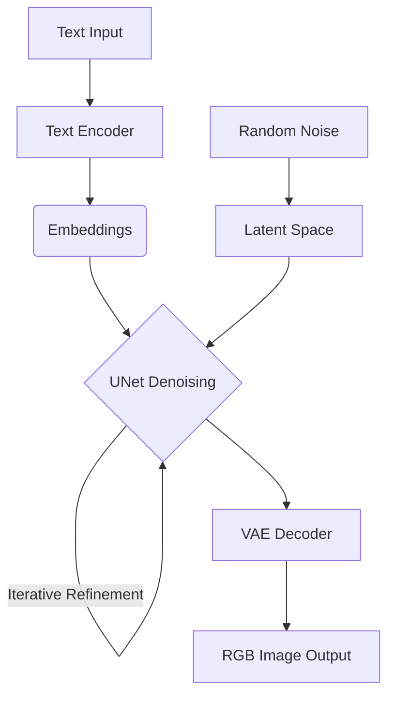

Have you ever wondered how tools like Stable Diffusion or SDXL can turn a short text prompt into a stunning, photo-realistic image? At first glance, it feels like magic. But behind the scenes, there's a fascinating process grounded in math, probability and clever engineering.

I will break it down step by step so that anyone, even without a machine learning background, can understand basics of how diffusion models create images.

### From Noise to Image: Core Idea

Key ideas behind diffusion models are simple. They are also powerful.

Take an image and gradually add noise until it becomes pure static. Train a neural network to reverse this process. That is, to take noisy images and predict clean versions.

Once trained, models can start with random noise and denoise it step by step, guided by your text prompt, until a meaningful image emerges.

Think of it like sculpting. You start with a block of marble representing random noise. With each step, algorithms chip away unnecessary parts until a final image takes shape.

### Role of Text Prompts

How does a model know what to sculpt? This is where text embeddings come in.

When you type:
> "A futuristic city floating in the clouds, cyberpunk style"

Text is processed by a text encoder (like CLIP in Stable Diffusion), which converts words into a mathematical representation called embeddings. These embeddings guide diffusion models during denoising, nudging it toward generating images matching the meaning of your prompt.

So, at each step of denoising, models aren't just trying to remove noise. They are also aligning results with your description.

### Step-by-Step Process

Here's what happens inside a modern diffusion pipeline like Stable Diffusion XL (SDXL):

**Text Input**
You provide a text prompt.

**Text Encoding**
A text encoder (like CLIP in Stable Diffusion or a dual-transformer setup in SDXL) converts your prompt into embeddings, which guide image generation.

**Noise Initialization**
Process begins with pure random noise in a latent space, a compressed abstract representation of an image that allows for efficient processing and manipulation.

**Denoising with UNet**
A neural network called UNet iteratively removes noise from latents, guided by text embeddings. This happens over a configurable number of steps (often 20 to 50), gradually refining details with each pass.

**Latent to Image**
Once denoising is complete, a VAE (Variational Autoencoder) decoder reconstructs full-resolution RGB images from compressed latent representations.

**Final Output**
Images can now be saved as PNG, JPEG or any format you like.

### An Intuitive Example

Imagine you ask a model to generate:
> "A cat wearing sunglasses, sitting on a beach."

* **Step 20 (still noisy):** vague blobs might start resembling shapes.
* **Step 15:** outlines of a cat and background emerge.
* **Step 10:** sunglasses, fur texture and beach details sharpen.
* **Step 5:** details refine further.
* **Step 0:** a crisp, fun image of a cat chilling at the beach.

Each step gradually removes uncertainty while aligning output with your text description.

### Hands-On Exploration

Check out these resources to experience diffusion models in action:

* [Stable Diffusion 3.5 Web Demo](https://huggingface.co/spaces/stabilityai/stable-diffusion-3.5-large): Experiment with the latest Stable Diffusion model and generate images from text prompts in real time.
* [Diffusion Explainer](https://poloclub.github.io/diffusion-explainer/): Detailed, step-by-step guide showing how SDXL converts noise into images.

First lets you experiment hands-on, second helps you understand internal processes behind image generation.

### Why It Matters

Diffusion models represent a massive leap forward in generative AI. Unlike older methods, they:
* Produce high-quality, detailed images.
* Allow for fine control via text prompts.
* Work flexibly for variations like image-to-image or inpainting (filling in missing parts of an image).

This ability to control creativity makes them useful not just for art but also for product design, gaming, medical imaging and edge-AI applications where devices themselves can generate visuals.

### Collaborating with Machines

What feels like magic is really just power of probability, noise modeling and deep learning coming together. By breaking down images into noise and learning to reverse the process step by step, diffusion models unlock a whole new way for humans and machines to collaborate creatively.

Next time you type a prompt into a generative AI tool, you'll know exactly how that "random noise" is being sculpted into your masterpiece.

*Note: This article was originally published on my [Medium account](https://medium.com/@tribhuwan_86668/demystifying-diffusion-models-how-ai-generates-images-from-noise-5cd7ff12eb2a).*
