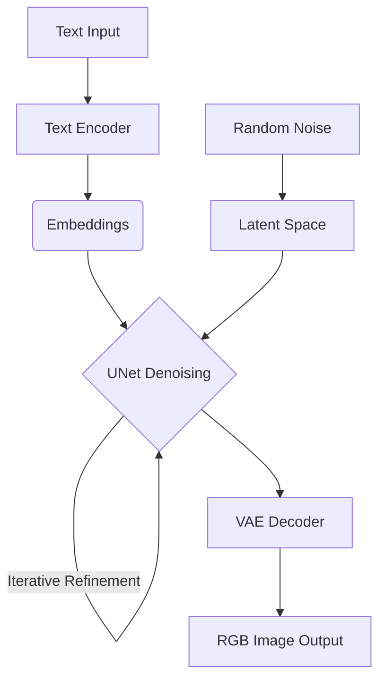

When evaluating generative architectures for edge deployment engineers frequently encounter diffusion pipelines. At first glance mapping short text strings to photorealistic pixels feels inherently unstable.

Behind that abstraction layer lies a rigorous pipeline. It is grounded entirely in probability modeling and matrix transformations. We are not conjuring pixels. We are reversing entropy. 

Think of reversing entropy like physical sculpting. You start with an unshaped block of marble representing pure random noise. With each step algorithms chip away unnecessary artifacts until final geometric shapes emerge.

### Signal Processing and Noise

Consider traditional signal degradation. We inject Gaussian noise into pristine visual matrices until reaching pure thermal static. Training requires neural networks to recursively invert this trajectory. Just as human sculptors study physical anatomy to carve marble models learn mapping chaotic noise back to structured pixels.

Models take noisy multidimensional tensors and predict clean topologies. Once weights converge inference begins with random noise. Networks denoise step by step. Text prompts act as mathematical anchors pulling outputs toward specific semantic manifolds. By projecting semantic context through cross-attention layers embedded deep within UNet bottlenecks these systems force initially chaotic probability distributions to collapse into highly specific topological structures perfectly mirroring human intent.

### Text Embeddings

How do models map string characters to visual geometry? Text encoders bridge semantic and visual domains.

Input text passes through encoder layers. Words become high-dimensional embeddings. These vectors guide diffusion during denoising. They force gradients to align output tensors with semantic intent. Models do not simply remove noise. They actively carve pathways through probability space much like artists use reference sketches guiding their chisels.

### Pipeline Architecture

Modern pipelines operate within compressed latent spaces rather than pixel dimensions. This architectural choice drastically reduces compute requirements making edge deployment feasible. 

**Text Encoding**
Encoders convert prompts into tensors driving cross-attention mechanisms. 

**Latent Initialization**
Operations begin with random noise within compressed abstract spaces. Processing dense abstractions is exponentially faster than manipulating native RGB arrays.

**Iterative Denoising**
A UNet architecture iteratively strips noise from latents. This loops over configurable steps. Each iteration leverages text embeddings to resolve finer structural details.

**Decoding via VAE**
After UNet refinement Variational Autoencoders reconstruct full-resolution image arrays from compressed latent dimensions.

### Progression Mechanics

During execution resolution increases non-linearly. Early steps process high-frequency noise. Vague geometric blobs emerge. Intermediate passes lock down dominant structural boundaries. Final iterations sharpen textures and handle granular detail generation. Each step progressively removes uncertainty.

### Generative Implications

Older adversarial models struggled with mode collapse and training instability. Diffusion provides mathematically grounded convergence. It ensures high-fidelity detail synthesis. It enables fine-grained control via text conditioning.

Capabilities extend beyond static generation to inpainting and style transfer. Controlling creative synthesis mathematically makes these pipelines critical for product design and edge-AI integration. Processing visual data locally on devices requires efficient robust abstractions.

This is not magic. It is stochastic noise modeling combined with deep representation learning. By teaching networks to sculpt structured meaning out of random static we establish entirely new collaborative interfaces between humans and silicon.

*Note: This article was originally published on my Medium account.*
